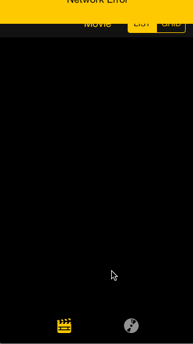

# RottenTomatoes HW1

Time spent: 8 hours spent in total

Completed user stories:

 * [x] Required: User can view a list of movies from Rotten Tomatoes. Poster images must be loading asynchronously.
 * [x] Required: User can view movie details by tapping on a cell.
 * [x] Required: User sees loading state while waiting for movies API.
 * [x] Required: User sees error message when there's a networking error
 * [x] Required: User can pull to refresh the movie list.
 * [x] Optional: Add a tab bar for Box Office and DVD.
 * [x] Optional: Implement segmented control to switch between list view and grid view  
 * [x] Optional: All images fade in (in movie table list)
 * [x] Optional: For the large poster, load the low-res image first, switch to high-res when complete 
 * [x] Optional: Customize the highlight and selection effect of the cell (Original : gray, Customize : black)
 * [x] Optional: Customize the navigation bar.
 
Walkthrough of all user stories:

GIF created with [LiceCap](http://www.cockos.com/licecap/).
3rd party library(SVProgressHUD, AFNetworking) with [Coacopods](http://cocoapods.org/)
